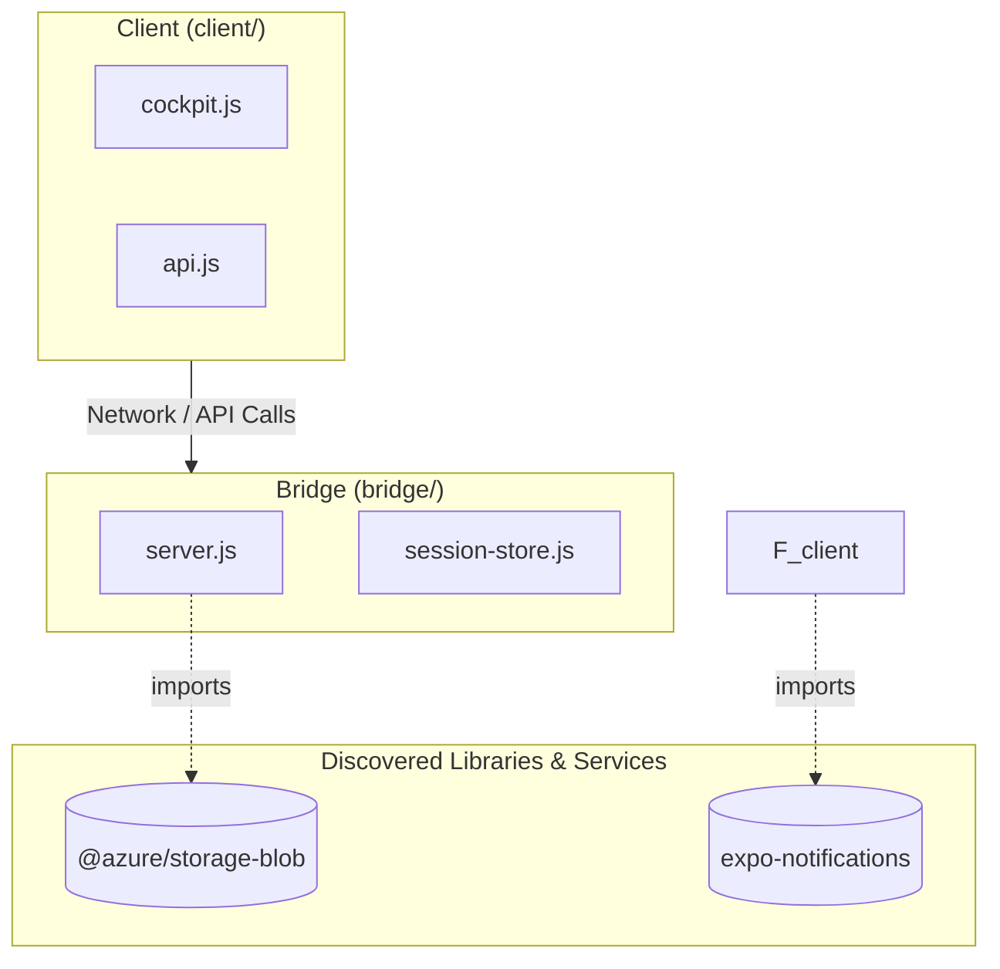

# 🗺️ arch-map

> **Fast, zero-config CLI that statically scans any codebase to generate visual architecture mental models and lift-and-shift environment matrices in Markdown.**

[](https://opensource.org/licenses/MIT)
[](https://www.python.org/downloads/)
[]()

---

## ⚡ Why arch-map?

Understanding how a codebase works—what files call what services, what routes exist, and what environment variables are needed to deploy it—usually requires hours of manual digging.

`arch-map` automatically scans your repository in **under 1 second** and produces a complete, multi-level architectural mental model in clean GitHub-flavored Markdown with interactive **Mermaid.js** diagrams.

* 🧠 **Zero Hardcoding**: Dynamically discovers packages, imports, and clients directly from your code—no config files or dictionaries needed.
* ☁️ **Cloud & Service Topology**: Automatically maps connections between source files and third-party cloud SDKs (Azure, AWS, databases, queues, AI APIs).
* 🚀 **Lift-and-Shift Environment Matrix**: Automatically finds all `.env*` files and scans code for `process.env`, `os.environ`, `std::env::var`, and `os.Getenv` to produce an environment migration checklist for rapid deployments (`dev` ↔ `uat` ↔ `prod`).
* 📦 **Zero External Dependencies**: Written in pure Python 3 using standard library only.

---

## 🚀 Quickstart

### 1. One-Line Install (macOS / Linux)
```bash
curl -fsSL https://raw.githubusercontent.com/Dodhon/arch-map/main/install.sh | bash
```
*(Or clone the repo and run `./install.sh`)*

### 2. Run It on Any Repository
```bash
# Scan current repository (writes to ./docs/architecture-mental-model.md)
arch-map .

# Scan a specific project path
arch-map /path/to/my-project

# Custom output path
arch-map /path/to/my-project -o ./ARCHITECTURE.md

# Print directly to terminal
arch-map . --stdout

# Lint all Markdown and Mermaid diagrams in a directory or file
arch-map --lint .
```

---

## 📊 What It Generates

`arch-map` outputs a structured Markdown document containing 6 distinct architectural views:

### 1. Level 1: System Topology & External Dependencies (Mermaid)
Maps internal subsystem directories to all discovered external libraries and cloud SDKs.



### 2. Level 2: Component Routing & Client Call Graph (Mermaid)
Maps all discovered HTTP/RPC endpoints (`app.get`, `method === 'POST'`, `@router.get`) directly to instantiated client classes (`BlobServiceClient`, `SessionStore`, `Pool`).

### 3. Level 3: Request/Response Execution Sequence (Mermaid)
Traces data flow from user interaction through routing, state persistence, backend processing, and external services.

### 4. Level 4: Endpoint Registry Table
A clean, searchable table of every route, HTTP method, source file, and subsystem.

### 5. Level 5: Lift-and-Shift Environment Readiness Matrix
An inventory of every environment variable required to deploy or migrate the codebase:

| Environment Variable | Consumed In Code | Declared In Config | Category / Inferred Type |
| :--- | :--- | :--- | :--- |
| **`EXPO_ACCESS_TOKEN`** | `push-notifications.js` | *Runtime only* | 🔒 Secret / Token |
| **`OMP_PHONE_TOKEN`** | `server.js` | `.env.example` | 🔒 Secret / Token |
| **`BRIDGE_URL`** | `local-release.js` | *Runtime only* | 🌐 Endpoint / Connection |
| **`DISABLE_SESSION_INDEX`** | `server.js` | *Runtime only* | ⚙️ Feature Flag / Mode |

### 6. Level 6: Discovered Dependencies Table
All third-party libraries referenced in code, cross-referenced with manifest declarations.

---

## 🛠️ Supported Languages & Ecosystems

* **Languages**: TypeScript, JavaScript, Python, Rust, Go, Swift, C/C++, Shell.
* **Manifests**: `package.json`, `Cargo.toml`, `requirements.txt`, `pyproject.toml`, `go.mod`.
* **Frameworks**: Express, Fastify, Koa, Node HTTP, Next.js, FastAPI, Flask, Django, Axum, Actix, Gin, etc.
* **Environment Files**: `.env*`, `config.json`, `config.yaml`, `appsettings.json`, `wrangler.toml`, `docker-compose.yml`, `serverless.yml`, `terraform.tfvars`.

---

## 🤝 Contributing

Contributions are welcome! Feel free to open an issue or submit a pull request on [GitHub](https://github.com/Dodhon/arch-map).

---

## 📄 License

[MIT License](LICENSE) © 2026 Thupten Wangpo
