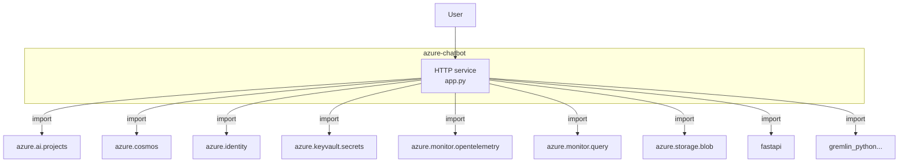
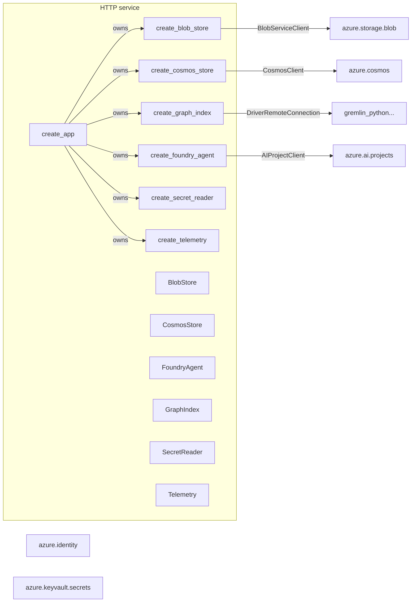
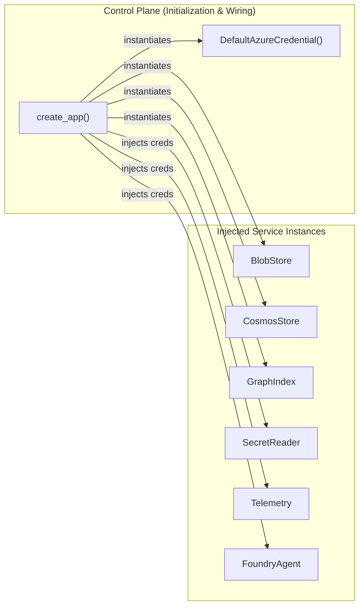
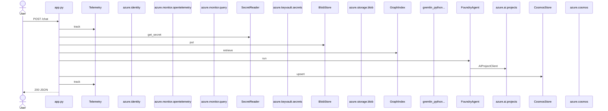
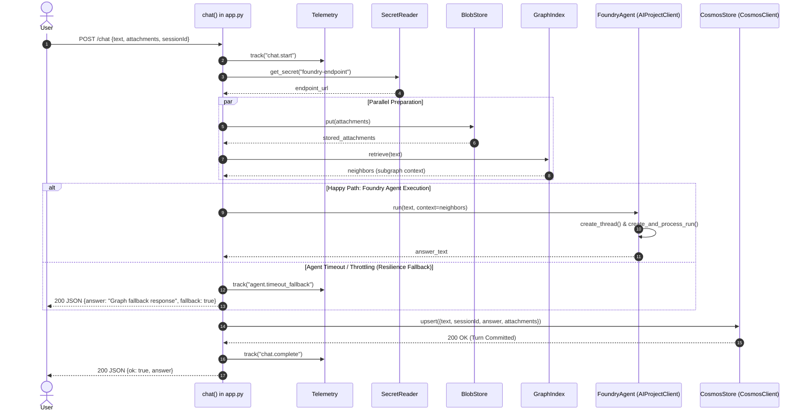

# ⚖️ Architecture Comparison: Current (`v1`) vs. Next Iteration (`v2`)

> **Context**: Evaluating how `arch-map` output evolves from raw AST structural graphs (`v1`) into Big-Tech review-ready architectural specifications (`v2`) based on the `examples/azure-chatbot` codebase.

---

## Summary of Architectural Upgrades

| Architectural Dimension | Current Version (`v1`) | Next Iteration (`v2` Big-Tech Standard) | Value for Architecture Review |
| :--- | :--- | :--- | :--- |
| **Trust Boundaries** | Single boundary around codebase | Demarcates Public User, Ingress Auth, App Boundary, Cloud APIs | Identifies attack surface and auth perimeter |
| **Control Plane vs Data Plane** | Mixed together in Level 2 | Split into **2a (Wiring/Injection)** and **2b (Data-Flow Topology)** | Conforms to Amazon Principal Engineering standard |
| **Client-to-Client Data Flow** | Functions point only at imports | Direct edges showing data handoff (Graph $\rightarrow$ Foundry $\rightarrow$ Cosmos) | Answers *"How do cloud services exchange data?"* |
| **Storage Semantics** | Generic rectangular import boxes | Cylinders `[()]` for DBs, Disks `[([])]` for Object Stores | Instant visual distinction of persistence tiers |
| **Transport Semantics** | Solid arrows for all calls | Solid for synchronous RPC; dotted for async/event paths | Highlights blocking latency and decoupling points |
| **Failure Modes & Fallbacks** | Happy path only | Sequence diagrams include `alt / opt` error & fallback branches | SRE/Resilience review ready (Chaos / Circuit Breakers) |

---

## 1. Level 1: System Context & Trust Boundaries

### Current Version (`v1`)
Flat system boundary with outbound import arrows.



---

### Next Iteration (`v2` — Big-Tech Context & Perimeter Boundary)
Separates Client Zone, Application Workload, and Managed Cloud Perimeter with explicit protocol and authentication annotations.

```mermaid
flowchart TB
    subgraph ClientZone["Client Perimeter (Untrusted)"]
        User(["Client / Web App"])
    end

    subgraph AppBoundary["Workload Boundary (FastAPI App Service)"]
        AppSvc["app.py\nFastAPI Host (:8080)"]
    end

    subgraph CloudPerimeter["Azure Cloud Managed Services (Secured by DefaultAzureCredential)"]
        Foundry["Azure AI Foundry\nazure.ai.projects"]
        KeyVault["Azure Key Vault\nazure.keyvault.secrets"]
        BlobStore[([Azure Blob Storage\nazure.storage.blob])]
        CosmosDB[(Azure Cosmos DB\nazure.cosmos)]
        Gremlin[(Cosmos Gremlin Graph\ngremlin_python...)]
        AppInsights["Application Insights\nazure.monitor.opentelemetry"]
    end

    User -->|HTTPS POST /chat\nBearer Token| AppSvc
    AppSvc -->|HTTPS / Managed Identity| KeyVault
    AppSvc -->|HTTPS / Connection String| BlobStore
    AppSvc -->|WebSocket WSS / Token| Gremlin
    AppSvc -->|HTTPS / AIProjectClient| Foundry
    AppSvc -->|HTTPS / CosmosClient| CosmosDB
    AppSvc -.->|OTel Telemetry| AppInsights
```

---

## 2. Level 2: Service & Data-Flow Topology

### Current Version (`v1` — Flat Structural Ownership)
Shows factory functions owning other factories, and factories pointing at raw import bindings.



---

### Next Iteration (`v2` — Split Control Plane vs. Client Data-Flow Graph)

#### View 2a: Control Plane (Initialization & Dependency Injection)


#### View 2b: Data Plane (Runtime Client-to-Client Data Flow)
Statically extracted from AST parameter flow inside `POST /chat`:

```mermaid
flowchart LR
    Client(["User / Client"])
    Handler["chat() Handler"]

    subgraph StorageAndAI["External Persistence & AI Services"]
        BlobStore[([BlobStore\nazure.storage.blob])]
        GraphIndex[(GraphIndex\ngremlin_python...)]
        FoundryAgent["FoundryAgent\nazure.ai.projects"]
        CosmosStore[(CosmosStore\nazure.cosmos)]
        SecretReader["SecretReader\nazure.keyvault.secrets"]
        Telemetry["Telemetry\nazure.monitor.query"]
    end

    Client -->|1. POST /chat {text, attachments}| Handler
    Handler -.->|track start| Telemetry
    Handler -->|fetch endpoint config| SecretReader
    Handler -->|2. put files| BlobStore
    Handler -->|3. retrieve text| GraphIndex

    GraphIndex -->|neighbors| FoundryAgent
    Handler -->|4. run text + neighbors| FoundryAgent

    BlobStore -.->|attachments| CosmosStore
    FoundryAgent -->|5. answer| CosmosStore
    Handler -->|6. upsert session turn| CosmosStore

    CosmosStore -->|7. commit turn| Handler
    Handler -->|8. 200 JSON {answer}| Client
```

---

## 3. Level 3: Request Execution & State Transform Sequence

### Current Version (`v1`)
Linear happy-path sequence diagram without parameter semantics or error handling.



---

### Next Iteration (`v2` — Resilience & Fallback-Aware Sequence)
Includes payload contracts, intermediate state bindings, and `alt / opt` exception handling.



---

## 4. Lift-and-Shift Environment Readiness Matrix

### Standardized Level 5 View (Consolidated in both v1 & v2)

| Environment Variable | Consumed In | Declared In | Category / Inferred Type | Impact if Missing |
| :--- | :--- | :--- | :--- | :--- |
| **`AZURE_AI_PROJECT_ENDPOINT`** | `foundry.py` | `.env.example` | 🌐 Endpoint / Connection | 💥 Agent client fails initialization |
| **`AZURE_AI_MODEL_DEPLOYMENT_NAME`** | `foundry.py` | `.env.example` | ⚙️ Config Setting | 💥 Agent model routing fails |
| **`AZURE_STORAGE_CONNECTION_STRING`** | `blob.py` | `.env.example` | 🔒 Secret / Token | 💥 File uploads fail on start |
| **`AZURE_COSMOS_ENDPOINT`** | `cosmos.py` | `.env.example` | 🌐 Endpoint / Connection | 💥 Session history unavailable |
| **`AZURE_COSMOS_KEY`** | `cosmos.py` | `.env.example` | 🔒 Secret / Token | 💥 Cosmos authentication error |
| **`COSMOS_GREMLIN_ENDPOINT`** | `graph.py` | `.env.example` | 🌐 Endpoint / Connection | 💥 RAG graph retrieval disabled |
| **`AZURE_KEY_VAULT_URL`** | `secrets.py` | `.env.example` | 🔒 Secret / Token | 💥 Secret retrieval fails |
| **`APPLICATIONINSIGHTS_CONNECTION_STRING`** | `telemetry.py` | `.env.example` | 🌐 Endpoint / Connection | ⚠️ Observability disabled |
| **`LOG_ANALYTICS_WORKSPACE_ID`** | `telemetry.py` | `.env.example` | ⚙️ Config Setting | ⚠️ Failure queries disabled |
| **`PORT`** | `app.py` | *Runtime only* | 🌐 Endpoint / Connection | ℹ️ Defaults to 8080 |

---

## 5. Roadmap: Implementing `v2` in `arch_map.py`

1. **AST Data-Edge Extractor**:
   - Inspect AST function bodies for assignments where variable `A` is passed as an argument into call `B` (`neighbors = graph.retrieve(...)` $\rightarrow$ `foundry.run(..., neighbors)`).
   - Generate Mermaid edges: `C_GraphIndex -->|neighbors| C_FoundryAgent`.

2. **Storage Semantic Decorator**:
   - Detect storage packages (`@azure/storage-blob`, `azure-storage-blob`, `aws-sdk/s3`, `mongodb`, `cosmos`, `redis`, `pg`, `sql`).
   - Emit Mermaid storage shapes: `[(Database)]`, `[([Object Store])]`, `{{Cache}}`.

3. **Control Plane / Data Plane Partitioning**:
   - Automatically separate functions matching `create_*` or constructors from request handler scopes (`@app.post`, `handle()`).

4. **Exception / Fallback Branching in Level 3**:
   - Detect `try/except` and `try/catch` AST blocks in route handlers.
   - Render Mermaid `alt` blocks with error states and fallback responses.
