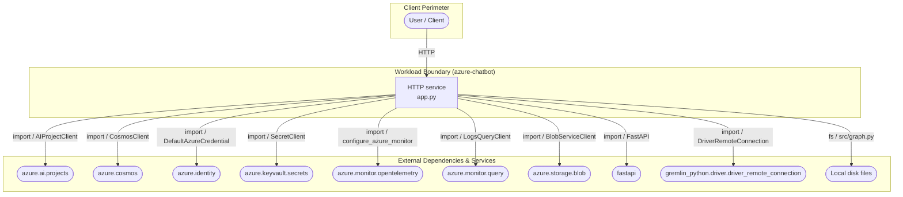
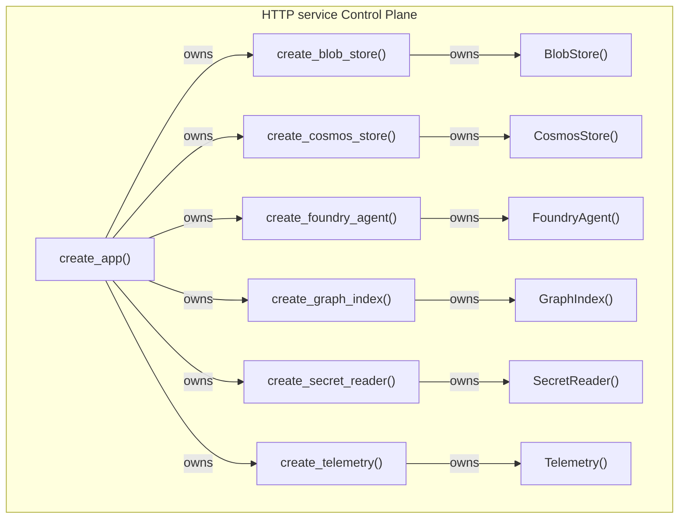
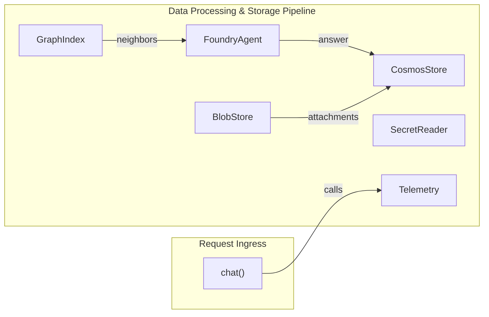
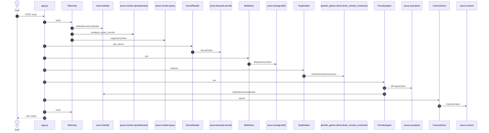

# azure-chatbot — Architecture

Generated by `arch-map` using **deterministic structural AST analysis** (brace-matched JS/TS and Python AST) plus **function → import** bindings and **client data flow**. Same codebase -> same document. Zero hallucinations. All components, routes, and data flows are clickable links to source code.

| View | Question | Source |
| :--- | :--- | :--- |
| **Level 1 — System context & external dependencies** | Who talks to this system, and what external packages/APIs are called? | Entrypoints, URL literals, `spawn`, imported packages |
| **Level 2a — Control plane (wiring)** | How is the application instantiated, configured, and injected? | Factory functions, constructors, and binding graph |
| **Level 2b — Data plane (client data flow)** | How do internal services and storage exchange data at runtime? | Route handlers, variable passing, and client data graph |
| **Level 3 — Request execution flow** | What happens on a critical request end-to-end? | Route handler call-graph walk, parameter contracts, and transforms |

---

## Level 1 — System context & external dependencies

Internal workload boundary versus external libraries, SDKs, and services. Internal folders such as `test/` and `scripts/` are omitted.

| External system | Kind | Evidence |
| :--- | :--- | :--- |
| **azure.ai.projects** | `import` | [`AIProjectClient`](azure-chatbot/src/foundry.py#L1) |
| **azure.cosmos** | `import` | [`CosmosClient`](azure-chatbot/src/cosmos.py#L1) |
| **azure.identity** | `import` | [`DefaultAzureCredential`](azure-chatbot/src/app.py#L1) |
| **azure.keyvault.secrets** | `import` | [`SecretClient`](azure-chatbot/src/secrets.py#L1) |
| **azure.monitor.opentelemetry** | `import` | [`configure_azure_monitor`](azure-chatbot/src/telemetry.py#L1) |
| **azure.monitor.query** | `import` | [`LogsQueryClient`](azure-chatbot/src/telemetry.py#L1) |
| **azure.storage.blob** | `import` | [`BlobServiceClient`](azure-chatbot/src/blob.py#L1) |
| **fastapi** | `import` | [`FastAPI`](azure-chatbot/src/app.py#L1) |
| **gremlin_python.driver.driver_remote_connection** | `import` | [`DriverRemoteConnection`](azure-chatbot/src/graph.py#L1) |
| **Local disk files** | `disk` | [`src/graph.py`](azure-chatbot/src/app.py#L1) |

---

## Level 2a — Control plane (Wiring & Dependency Injection)

Factory functions, constructors, and dependency injection wiring. Shows how service instances and client connections are assembled during startup. Click any node to jump directly to its definition.

---

## Level 2b — Data plane (Client-to-client data flow)

Runtime data-flow topology. Shows how client components pass intermediate data (arguments, return values) to downstream storage and cloud APIs during request execution. Click any node to jump to its source.

Function → import bindings:

| Component / Function | Import | Binding | File |
| :--- | :--- | :--- | :--- |
| [`create_app`](azure-chatbot/src/app.py#L12) | `azure.identity` | `DefaultAzureCredential` | [`src/app.py:12`](azure-chatbot/src/app.py#L12) |
| [`create_app`](azure-chatbot/src/app.py#L12) | `fastapi` | `FastAPI` | [`src/app.py:12`](azure-chatbot/src/app.py#L12) |
| [`create_blob_store`](azure-chatbot/src/blob.py#L14) | `azure.storage.blob` | `BlobServiceClient` | [`src/blob.py:14`](azure-chatbot/src/blob.py#L14) |
| [`create_cosmos_store`](azure-chatbot/src/cosmos.py#L13) | `azure.cosmos` | `CosmosClient` | [`src/cosmos.py:13`](azure-chatbot/src/cosmos.py#L13) |
| [`create_foundry_agent`](azure-chatbot/src/foundry.py#L24) | `azure.ai.projects` | `AIProjectClient` | [`src/foundry.py:24`](azure-chatbot/src/foundry.py#L24) |
| [`create_foundry_agent`](azure-chatbot/src/foundry.py#L24) | `azure.identity` | `DefaultAzureCredential` | [`src/foundry.py:24`](azure-chatbot/src/foundry.py#L24) |
| [`create_graph_index`](azure-chatbot/src/graph.py#L16) | `gremlin_python.driver.driver_remote_connection` | `DriverRemoteConnection` | [`src/graph.py:16`](azure-chatbot/src/graph.py#L16) |
| [`create_secret_reader`](azure-chatbot/src/secrets.py#L14) | `azure.keyvault.secrets` | `SecretClient` | [`src/secrets.py:14`](azure-chatbot/src/secrets.py#L14) |
| [`create_telemetry`](azure-chatbot/src/telemetry.py#L21) | `azure.identity` | `DefaultAzureCredential` | [`src/telemetry.py:21`](azure-chatbot/src/telemetry.py#L21) |
| [`create_telemetry`](azure-chatbot/src/telemetry.py#L21) | `azure.monitor.opentelemetry` | `configure_azure_monitor` | [`src/telemetry.py:21`](azure-chatbot/src/telemetry.py#L21) |
| [`create_telemetry`](azure-chatbot/src/telemetry.py#L21) | `azure.monitor.query` | `LogsQueryClient` | [`src/telemetry.py:21`](azure-chatbot/src/telemetry.py#L21) |

Extracted client-to-client data edges (from AST):

| Source Component | Target Component | Passed Variable / Data |
| :--- | :--- | :--- |
| [`GraphIndex`](azure-chatbot/src/graph.py#L1) | [`FoundryAgent`](azure-chatbot/src/foundry.py#L1) | `neighbors` |
| [`FoundryAgent`](azure-chatbot/src/foundry.py#L1) | [`CosmosStore`](azure-chatbot/src/cosmos.py#L1) | `answer` |
| [`BlobStore`](azure-chatbot/src/blob.py#L1) | [`CosmosStore`](azure-chatbot/src/cosmos.py#L1) | `attachments` |

---

## Level 3 — Request execution flow

Traced **`POST /chat`** from [`src/app.py:23`](azure-chatbot/src/app.py#L23). Handler call-graph walk with parameter bindings.

Request body fields read in handler: `text`.

### Transform table

| Step | From → To | Action | Where |
| :--- | :--- | :--- | :--- |
| 1 | `User` → `HTTP` | `POST /chat` | [`src/app.py:1`](azure-chatbot/src/app.py#L1) |
| 2 | `HTTP` → `Telemetry` | `track` | [`src/telemetry.py:7`](azure-chatbot/src/telemetry.py#L7) |
| 3 | `Telemetry` → `azure.identity` | `DefaultAzureCredential` | [`src/telemetry.py:1`](azure-chatbot/src/telemetry.py#L1) |
| 4 | `Telemetry` → `azure.monitor.opentelemetry` | `configure_azure_monitor` | [`src/telemetry.py:1`](azure-chatbot/src/telemetry.py#L1) |
| 5 | `Telemetry` → `azure.monitor.query` | `LogsQueryClient` | [`src/telemetry.py:1`](azure-chatbot/src/telemetry.py#L1) |
| 6 | `HTTP` → `SecretReader` | `get_secret` | [`src/secrets.py:5`](azure-chatbot/src/secrets.py#L5) |
| 7 | `SecretReader` → `azure.keyvault.secrets` | `SecretClient` | [`src/secrets.py:1`](azure-chatbot/src/secrets.py#L1) |
| 8 | `HTTP` → `BlobStore` | `put` | [`src/blob.py:5`](azure-chatbot/src/blob.py#L5) |
| 9 | `BlobStore` → `azure.storage.blob` | `BlobServiceClient` | [`src/blob.py:1`](azure-chatbot/src/blob.py#L1) |
| 10 | `HTTP` → `GraphIndex` | `retrieve` | [`src/graph.py:5`](azure-chatbot/src/graph.py#L5) |
| 11 | `GraphIndex` → `gremlin_python.driver.driver_remote_connection` | `DriverRemoteConnection` | [`src/graph.py:1`](azure-chatbot/src/graph.py#L1) |
| 12 | `HTTP` → `FoundryAgent` | `run` | [`src/foundry.py:6`](azure-chatbot/src/foundry.py#L6) |
| 13 | `FoundryAgent` → `azure.ai.projects` | `AIProjectClient` | [`src/foundry.py:1`](azure-chatbot/src/foundry.py#L1) |
| 14 | `FoundryAgent` → `azure.identity` | `DefaultAzureCredential` | [`src/foundry.py:1`](azure-chatbot/src/foundry.py#L1) |
| 15 | `HTTP` → `CosmosStore` | `upsert` | [`src/cosmos.py:5`](azure-chatbot/src/cosmos.py#L5) |
| 16 | `CosmosStore` → `azure.cosmos` | `CosmosClient` | [`src/cosmos.py:1`](azure-chatbot/src/cosmos.py#L1) |
| 17 | `HTTP` → `Telemetry` | `track` | [`src/telemetry.py:7`](azure-chatbot/src/telemetry.py#L7) |

---

## Routes

| Method | Path | Defined in |
| :--- | :--- | :--- |
| `POST` | [`/chat`](azure-chatbot/src/app.py#L23) | [`src/app.py:23`](azure-chatbot/src/app.py#L23) |
| `GET` | [`/health`](azure-chatbot/src/app.py#L39) | [`src/app.py:39`](azure-chatbot/src/app.py#L39) |

---

## Environment & lift-and-shift matrix

Inventory of environment variables required to run or migrate this codebase.

| Environment variable | Consumed in | Declared in |
| :--- | :--- | :--- |
| `APPLICATIONINSIGHTS_CONNECTION_STRING` | [`telemetry.py`](azure-chatbot/src/telemetry.py#L1) | [`.env.example`](azure-chatbot/.env.example#L1) |
| `AZURE_AI_MODEL_DEPLOYMENT_NAME` | [`foundry.py`](azure-chatbot/src/foundry.py#L1) | [`.env.example`](azure-chatbot/.env.example#L1) |
| `AZURE_AI_PROJECT_ENDPOINT` | [`foundry.py`](azure-chatbot/src/foundry.py#L1) | [`.env.example`](azure-chatbot/.env.example#L1) |
| `AZURE_CLIENT_ID` | *Declared only* | [`.env.example`](azure-chatbot/.env.example#L1) |
| `AZURE_CLIENT_SECRET` | *Declared only* | [`.env.example`](azure-chatbot/.env.example#L1) |
| `AZURE_COSMOS_ENDPOINT` | [`cosmos.py`](azure-chatbot/src/cosmos.py#L1) | [`.env.example`](azure-chatbot/.env.example#L1) |
| `AZURE_COSMOS_KEY` | [`cosmos.py`](azure-chatbot/src/cosmos.py#L1) | [`.env.example`](azure-chatbot/.env.example#L1) |
| `AZURE_KEY_VAULT_URL` | [`secrets.py`](azure-chatbot/src/secrets.py#L1) | [`.env.example`](azure-chatbot/.env.example#L1) |
| `AZURE_STORAGE_CONNECTION_STRING` | [`blob.py`](azure-chatbot/src/blob.py#L1) | [`.env.example`](azure-chatbot/.env.example#L1) |
| `AZURE_TENANT_ID` | *Declared only* | [`.env.example`](azure-chatbot/.env.example#L1) |
| `COSMOS_GREMLIN_ENDPOINT` | [`graph.py`](azure-chatbot/src/graph.py#L1) | [`.env.example`](azure-chatbot/.env.example#L1) |
| `LOG_ANALYTICS_WORKSPACE_ID` | [`telemetry.py`](azure-chatbot/src/telemetry.py#L1) | [`.env.example`](azure-chatbot/.env.example#L1) |
| `PORT` | [`app.py`](azure-chatbot/src/app.py#L1) | *Runtime only* |
