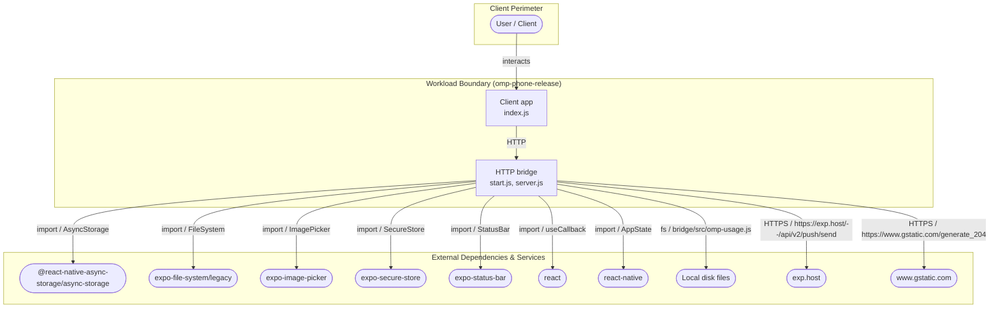
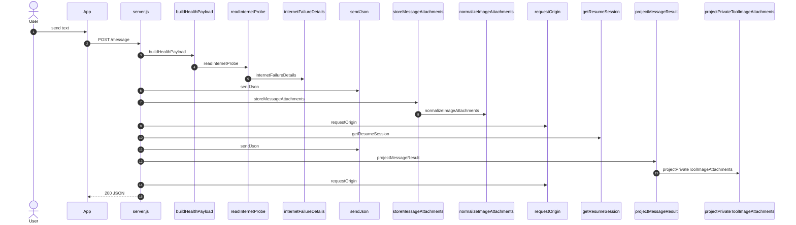

# omp-phone-release — Architecture

Generated by `arch-map` using **deterministic structural AST analysis** (brace-matched JS/TS and Python AST) plus **function → import** bindings and **client data flow**. Same codebase -> same document. Zero hallucinations. All components, routes, and data flows are clickable links to source code.

| View | Question | Source |
| :--- | :--- | :--- |
| **Level 1 — System context & external dependencies** | Who talks to this system, and what external packages/APIs are called? | Entrypoints, URL literals, `spawn`, imported packages |
| **Level 2a — Control plane (wiring)** | How is the application instantiated, configured, and injected? | Factory functions, constructors, and binding graph |
| **Level 2b — Data plane (client data flow)** | How do internal services and storage exchange data at runtime? | Route handlers, variable passing, and client data graph |
| **Level 3 — Request execution flow** | What happens on a critical request end-to-end? | Route handler call-graph walk, parameter contracts, and transforms |

---

## Level 1 — System context & external dependencies

Internal workload boundary versus external libraries, SDKs, and services. Internal folders such as `test/` and `scripts/` are omitted.

| External system | Kind | Evidence |
| :--- | :--- | :--- |
| **@react-native-async-storage/async-storage** | `import` | [`AsyncStorage`](../../../../services/omp-phone-release/client/App.js#L1) |
| **expo-file-system/legacy** | `import` | [`FileSystem`](../../../../services/omp-phone-release/client/App.js#L1) |
| **expo-image-picker** | `import` | [`ImagePicker`](../../../../services/omp-phone-release/client/App.js#L1) |
| **expo-secure-store** | `import` | [`SecureStore`](../../../../services/omp-phone-release/client/App.js#L1) |
| **expo-status-bar** | `import` | [`StatusBar`](../../../../services/omp-phone-release/client/App.js#L1) |
| **react** | `import` | [`useCallback`](../../../../services/omp-phone-release/client/App.js#L1) |
| **react-native** | `import` | [`AppState`](../../../../services/omp-phone-release/client/App.js#L1) |
| **Local disk files** | `disk` | [`bridge/src/omp-usage.js`](../../../../services/omp-phone-release/bridge/src/omp-session-index.js#L1) |
| **exp.host** | `http` | [`https://exp.host/--/api/v2/push/send`](../../../../services/omp-phone-release/bridge/src/push-notifications.js#L1) |
| **www.gstatic.com** | `http` | [`https://www.gstatic.com/generate_204`](../../../../services/omp-phone-release/bridge/src/server.js#L1) |

---

## Level 2a — Control plane (Wiring & Dependency Injection)

Factory functions, constructors, and dependency injection wiring. Shows how service instances and client connections are assembled during startup. Click any node to jump directly to its definition.

```mermaid
flowchart TB
    subgraph CP_bridge["HTTP bridge Control Plane"]
        C_OmpRpcTransport["OmpRpcTransport()"]
        C_OmpSessionIndex["OmpSessionIndex()"]
        C_PushNotificationRegistry["PushNotificationRegistry()"]
        C_SessionStore["SessionStore()"]
        C_createBridgeServer["createBridgeServer()"]
        C_checkInternetConnectivity["checkInternetConnectivity()"]
        C_defaultSessionIndex["defaultSessionIndex()"]
        C_defaultTransportFactory["defaultTransportFactory()"]
        C_start["start()"]
    end
    subgraph CP_client["Client app Control Plane"]
        C_App["App()"]
        C_enablePushNotifications["enablePushNotifications()"]
        C_persistConversationCache["persistConversationCache()"]
        C_pickImageFromLibrary["pickImageFromLibrary()"]
        C_selectSession["selectSession()"]
        C_send["send()"]
        C_startNewChat["startNewChat()"]
        C_syncActiveSession["syncActiveSession()"]
        C_takePicture["takePicture()"]
        C_createOmpPhoneApi["createOmpPhoneApi()"]
        C_request["request()"]
    end
    C_createBridgeServer -->|owns| C_SessionStore
    C_createBridgeServer -->|owns| C_PushNotificationRegistry
    C_defaultSessionIndex -->|owns| C_OmpSessionIndex
    C_defaultTransportFactory -->|owns| C_OmpRpcTransport
    C_App -->|uses| C_createOmpPhoneApi
    C_createOmpPhoneApi -->|HTTP| C_createBridgeServer
    click C_OmpRpcTransport href "../../../../services/omp-phone-release/bridge/src/omp-rpc-transport.js#L15" "Jump to OmpRpcTransport in bridge/src/omp-rpc-transport.js"
    click C_OmpSessionIndex href "../../../../services/omp-phone-release/bridge/src/omp-session-index.js#L16" "Jump to OmpSessionIndex in bridge/src/omp-session-index.js"
    click C_PushNotificationRegistry href "../../../../services/omp-phone-release/bridge/src/push-notifications.js#L21" "Jump to PushNotificationRegistry in bridge/src/push-notifications.js"
    click C_SessionStore href "../../../../services/omp-phone-release/bridge/src/session-store.js#L15" "Jump to SessionStore in bridge/src/session-store.js"
    click C_createBridgeServer href "../../../../services/omp-phone-release/bridge/src/server.js#L37" "Jump to createBridgeServer in bridge/src/server.js"
    click C_checkInternetConnectivity href "../../../../services/omp-phone-release/bridge/src/server.js#L589" "Jump to checkInternetConnectivity in bridge/src/server.js"
    click C_defaultSessionIndex href "../../../../services/omp-phone-release/bridge/src/server.js#L450" "Jump to defaultSessionIndex in bridge/src/server.js"
    click C_defaultTransportFactory href "../../../../services/omp-phone-release/bridge/src/server.js#L437" "Jump to defaultTransportFactory in bridge/src/server.js"
    click C_start href "../../../../services/omp-phone-release/bridge/src/usage-snapshot.js#L49" "Jump to start in bridge/src/usage-snapshot.js"
    click C_App href "../../../../services/omp-phone-release/client/App.js#L139" "Jump to App in client/App.js"
    click C_enablePushNotifications href "../../../../services/omp-phone-release/client/App.js#L935" "Jump to enablePushNotifications in client/App.js"
    click C_persistConversationCache href "../../../../services/omp-phone-release/client/App.js#L574" "Jump to persistConversationCache in client/App.js"
    click C_pickImageFromLibrary href "../../../../services/omp-phone-release/client/App.js#L893" "Jump to pickImageFromLibrary in client/App.js"
    click C_selectSession href "../../../../services/omp-phone-release/client/App.js#L1042" "Jump to selectSession in client/App.js"
    click C_send href "../../../../services/omp-phone-release/client/App.js#L963" "Jump to send in client/App.js"
    click C_startNewChat href "../../../../services/omp-phone-release/client/App.js#L1081" "Jump to startNewChat in client/App.js"
    click C_syncActiveSession href "../../../../services/omp-phone-release/client/App.js#L464" "Jump to syncActiveSession in client/App.js"
    click C_takePicture href "../../../../services/omp-phone-release/client/App.js#L897" "Jump to takePicture in client/App.js"
    click C_createOmpPhoneApi href "../../../../services/omp-phone-release/client/src/api.js#L35" "Jump to createOmpPhoneApi in client/src/api.js"
    click C_request href "../../../../services/omp-phone-release/client/src/api.js#L40" "Jump to request in client/src/api.js"
```

---

## Level 2b — Data plane (Client-to-client data flow)

Runtime data-flow topology. Shows how client components pass intermediate data (arguments, return values) to downstream storage and cloud APIs during request execution. Click any node to jump to its source.

Function → import bindings:

| Component / Function | Import | Binding | File |
| :--- | :--- | :--- | :--- |
| [`App`](../../../../services/omp-phone-release/client/App.js#L139) | `@react-native-async-storage/async-storage` | `AsyncStorage` | [`client/App.js:139`](../../../../services/omp-phone-release/client/App.js#L139) |
| [`App`](../../../../services/omp-phone-release/client/App.js#L139) | `expo-file-system/legacy` | `FileSystem` | [`client/App.js:139`](../../../../services/omp-phone-release/client/App.js#L139) |
| [`App`](../../../../services/omp-phone-release/client/App.js#L139) | `expo-image-picker` | `ImagePicker` | [`client/App.js:139`](../../../../services/omp-phone-release/client/App.js#L139) |
| [`App`](../../../../services/omp-phone-release/client/App.js#L139) | `expo-secure-store` | `SecureStore` | [`client/App.js:139`](../../../../services/omp-phone-release/client/App.js#L139) |
| [`App`](../../../../services/omp-phone-release/client/App.js#L139) | `expo-status-bar` | `StatusBar` | [`client/App.js:139`](../../../../services/omp-phone-release/client/App.js#L139) |
| [`App`](../../../../services/omp-phone-release/client/App.js#L139) | `react` | `useCallback` | [`client/App.js:139`](../../../../services/omp-phone-release/client/App.js#L139) |
| [`App`](../../../../services/omp-phone-release/client/App.js#L139) | `react-native` | `AppState` | [`client/App.js:139`](../../../../services/omp-phone-release/client/App.js#L139) |
| [`enablePushNotifications`](../../../../services/omp-phone-release/client/App.js#L935) | `@react-native-async-storage/async-storage` | `AsyncStorage` | [`client/App.js:935`](../../../../services/omp-phone-release/client/App.js#L935) |
| [`persistConversationCache`](../../../../services/omp-phone-release/client/App.js#L574) | `@react-native-async-storage/async-storage` | `AsyncStorage` | [`client/App.js:574`](../../../../services/omp-phone-release/client/App.js#L574) |
| [`pickImageFromLibrary`](../../../../services/omp-phone-release/client/App.js#L893) | `expo-image-picker` | `ImagePicker` | [`client/App.js:893`](../../../../services/omp-phone-release/client/App.js#L893) |
| [`selectSession`](../../../../services/omp-phone-release/client/App.js#L1042) | `@react-native-async-storage/async-storage` | `AsyncStorage` | [`client/App.js:1042`](../../../../services/omp-phone-release/client/App.js#L1042) |
| [`send`](../../../../services/omp-phone-release/client/App.js#L963) | `react-native` | `Image` | [`client/App.js:963`](../../../../services/omp-phone-release/client/App.js#L963) |
| [`startNewChat`](../../../../services/omp-phone-release/client/App.js#L1081) | `@react-native-async-storage/async-storage` | `AsyncStorage` | [`client/App.js:1081`](../../../../services/omp-phone-release/client/App.js#L1081) |
| [`startNewChat`](../../../../services/omp-phone-release/client/App.js#L1081) | `react-native` | `Keyboard` | [`client/App.js:1081`](../../../../services/omp-phone-release/client/App.js#L1081) |
| [`syncActiveSession`](../../../../services/omp-phone-release/client/App.js#L464) | `react-native` | `AppState` | [`client/App.js:464`](../../../../services/omp-phone-release/client/App.js#L464) |
| [`takePicture`](../../../../services/omp-phone-release/client/App.js#L897) | `expo-image-picker` | `ImagePicker` | [`client/App.js:897`](../../../../services/omp-phone-release/client/App.js#L897) |

---

## Level 3 — Request execution flow

Traced **`POST /message`** from [`bridge/src/server.js:164`](../../../../services/omp-phone-release/bridge/src/server.js#L164). Handler call-graph walk with parameter bindings.

Request body fields read in handler: `attachments`, `sessionId`, `async`, `text`.

Branch: `body.async` chooses `startMessage` (non-blocking) vs `sendMessage` (await completion).

### Transform table

| Step | From → To | Action | Where |
| :--- | :--- | :--- | :--- |
| 1 | `User` → `HTTP` | `POST /message` | [`bridge/src/server.js:1`](../../../../services/omp-phone-release/bridge/src/server.js#L1) |
| 2 | `HTTP` → `buildHealthPayload` | `buildHealthPayload` | [`bridge/src/server.js:455`](../../../../services/omp-phone-release/bridge/src/server.js#L455) |
| 3 | `buildHealthPayload` → `readInternetProbe` | `readInternetProbe` | [`bridge/src/server.js:496`](../../../../services/omp-phone-release/bridge/src/server.js#L496) |
| 4 | `readInternetProbe` → `internetFailureDetails` | `internetFailureDetails` | [`bridge/src/server.js:627`](../../../../services/omp-phone-release/bridge/src/server.js#L627) |
| 5 | `HTTP` → `sendJson` | `sendJson` | [`bridge/src/server.js:815`](../../../../services/omp-phone-release/bridge/src/server.js#L815) |
| 6 | `HTTP` → `storeMessageAttachments` | `storeMessageAttachments` | [`bridge/src/server.js:766`](../../../../services/omp-phone-release/bridge/src/server.js#L766) |
| 7 | `storeMessageAttachments` → `normalizeImageAttachments` | `normalizeImageAttachments` | [`bridge/src/image-attachments.js:38`](../../../../services/omp-phone-release/bridge/src/image-attachments.js#L38) |
| 8 | `HTTP` → `requestOrigin` | `requestOrigin` | [`bridge/src/server.js:731`](../../../../services/omp-phone-release/bridge/src/server.js#L731) |
| 9 | `HTTP` → `getResumeSession` | `getResumeSession` | [`bridge/src/server.js:554`](../../../../services/omp-phone-release/bridge/src/server.js#L554) |
| 10 | `HTTP` → `sendJson` | `sendJson` | [`bridge/src/server.js:815`](../../../../services/omp-phone-release/bridge/src/server.js#L815) |
| 11 | `HTTP` → `projectMessageResult` | `projectMessageResult` | [`bridge/src/server.js:737`](../../../../services/omp-phone-release/bridge/src/server.js#L737) |
| 12 | `projectMessageResult` → `projectPrivateToolImageAttachments` | `projectPrivateToolImageAttachments` | [`bridge/src/server.js:742`](../../../../services/omp-phone-release/bridge/src/server.js#L742) |
| 13 | `HTTP` → `requestOrigin` | `requestOrigin` | [`bridge/src/server.js:731`](../../../../services/omp-phone-release/bridge/src/server.js#L731) |

---

## Routes

| Method | Path | Defined in |
| :--- | :--- | :--- |
| `GET` | [`/ping`](../../../../services/omp-phone-release/bridge/src/server.js#L120) | [`bridge/src/server.js:120`](../../../../services/omp-phone-release/bridge/src/server.js#L120) |
| `GET` | [`/health`](../../../../services/omp-phone-release/bridge/src/server.js#L130) | [`bridge/src/server.js:130`](../../../../services/omp-phone-release/bridge/src/server.js#L130) |
| `GET` | [`/markdown-document`](../../../../services/omp-phone-release/bridge/src/server.js#L142) | [`bridge/src/server.js:142`](../../../../services/omp-phone-release/bridge/src/server.js#L142) |
| `GET` | [`/location`](../../../../services/omp-phone-release/bridge/src/server.js#L152) | [`bridge/src/server.js:152`](../../../../services/omp-phone-release/bridge/src/server.js#L152) |
| `POST` | [`/location`](../../../../services/omp-phone-release/bridge/src/server.js#L157) | [`bridge/src/server.js:157`](../../../../services/omp-phone-release/bridge/src/server.js#L157) |
| `POST` | [`/message`](../../../../services/omp-phone-release/bridge/src/server.js#L164) | [`bridge/src/server.js:164`](../../../../services/omp-phone-release/bridge/src/server.js#L164) |
| `GET` | [`/sessions`](../../../../services/omp-phone-release/bridge/src/server.js#L186) | [`bridge/src/server.js:186`](../../../../services/omp-phone-release/bridge/src/server.js#L186) |
| `GET` | [`/notifications/devices`](../../../../services/omp-phone-release/bridge/src/server.js#L192) | [`bridge/src/server.js:192`](../../../../services/omp-phone-release/bridge/src/server.js#L192) |
| `POST` | [`/notifications/devices`](../../../../services/omp-phone-release/bridge/src/server.js#L197) | [`bridge/src/server.js:197`](../../../../services/omp-phone-release/bridge/src/server.js#L197) |
| `POST` | [`/notifications/visibility`](../../../../services/omp-phone-release/bridge/src/server.js#L204) | [`bridge/src/server.js:204`](../../../../services/omp-phone-release/bridge/src/server.js#L204) |
| `POST` | [`/notifications/send`](../../../../services/omp-phone-release/bridge/src/server.js#L211) | [`bridge/src/server.js:211`](../../../../services/omp-phone-release/bridge/src/server.js#L211) |
| `GET` | [`/usage`](../../../../services/omp-phone-release/bridge/src/server.js#L223) | [`bridge/src/server.js:223`](../../../../services/omp-phone-release/bridge/src/server.js#L223) |

---

## Environment & lift-and-shift matrix

Inventory of environment variables required to run or migrate this codebase.

| Environment variable | Consumed in | Declared in |
| :--- | :--- | :--- |
| `EXPO_ACCESS_TOKEN` | [`push-notifications.js`](../../../../services/omp-phone-release/bridge/src/push-notifications.js#L1) | *Runtime only* |
| `NODE_TEST_CONTEXT` | [`logger.js`](../../../../services/omp-phone-release/bridge/src/logger.js#L1) | *Runtime only* |
| `OMP_COMMAND` | *Declared only* | [`.env.example`](../../../../services/omp-phone-release/.env.example#L1) |
| `OMP_PHONE_ALLOW_LOOPBACK_NO_TOKEN` | [`server.js`](../../../../services/omp-phone-release/bridge/src/server.js#L1) | *Runtime only* |
| `OMP_PHONE_BRIDGE_LABEL` | [`local-release.js`](../../../../services/omp-phone-release/scripts/lib/local-release.js#L1) | *Runtime only* |
| `OMP_PHONE_BRIDGE_PLIST` | [`local-release.js`](../../../../services/omp-phone-release/scripts/lib/local-release.js#L1) | *Runtime only* |
| `OMP_PHONE_BRIDGE_URL` | [`local-release.js`](../../../../services/omp-phone-release/scripts/lib/local-release.js#L1) | *Runtime only* |
| `OMP_PHONE_CONNECTIVITY_TIMEOUT_MS` | [`server.js`](../../../../services/omp-phone-release/bridge/src/server.js#L1) | *Runtime only* |
| `OMP_PHONE_CONNECTIVITY_URL` | [`server.js`](../../../../services/omp-phone-release/bridge/src/server.js#L1) | *Runtime only* |
| `OMP_PHONE_DISABLE_SESSION_INDEX` | [`server.js`](../../../../services/omp-phone-release/bridge/src/server.js#L1) | *Runtime only* |
| `OMP_PHONE_HOST` | *Declared only* | [`.env.example`](../../../../services/omp-phone-release/.env.example#L1) |
| `OMP_PHONE_LOG_LEVEL` | [`logger.js`](../../../../services/omp-phone-release/bridge/src/logger.js#L1) | *Runtime only* |
| `OMP_PHONE_MARKDOWN_ROOTS` | [`server.js`](../../../../services/omp-phone-release/bridge/src/server.js#L1) | *Runtime only* |
| `OMP_PHONE_METRO_LABEL` | [`local-release.js`](../../../../services/omp-phone-release/scripts/lib/local-release.js#L1) | *Runtime only* |
| `OMP_PHONE_METRO_PLIST` | [`local-release.js`](../../../../services/omp-phone-release/scripts/lib/local-release.js#L1) | *Runtime only* |
| `OMP_PHONE_METRO_URL` | [`local-release.js`](../../../../services/omp-phone-release/scripts/lib/local-release.js#L1) | *Runtime only* |
| `OMP_PHONE_PORT` | *Declared only* | [`.env.example`](../../../../services/omp-phone-release/.env.example#L1) |
| `OMP_PHONE_RELEASE_COMMIT` | [`server.js`](../../../../services/omp-phone-release/bridge/src/server.js#L1) | *Runtime only* |
| `OMP_PHONE_RELEASE_ROOT` | [`server.js`](../../../../services/omp-phone-release/bridge/src/server.js#L1), [`local-release.js`](../../../../services/omp-phone-release/scripts/lib/local-release.js#L1) | *Runtime only* |
| `OMP_PHONE_RELEASE_STATE_DIR` | [`local-release.js`](../../../../services/omp-phone-release/scripts/lib/local-release.js#L1) | *Runtime only* |
| `OMP_PHONE_TOKEN` | [`server.js`](../../../../services/omp-phone-release/bridge/src/server.js#L1) | [`.env.example`](../../../../services/omp-phone-release/.env.example#L1) |
| `OMP_PHONE_TRANSPORT` | [`server.js`](../../../../services/omp-phone-release/bridge/src/server.js#L1) | [`.env.example`](../../../../services/omp-phone-release/.env.example#L1) |
| `PI_CODING_AGENT_DIR` | [`omp-session-index.js`](../../../../services/omp-phone-release/bridge/src/omp-session-index.js#L1) | *Runtime only* |
