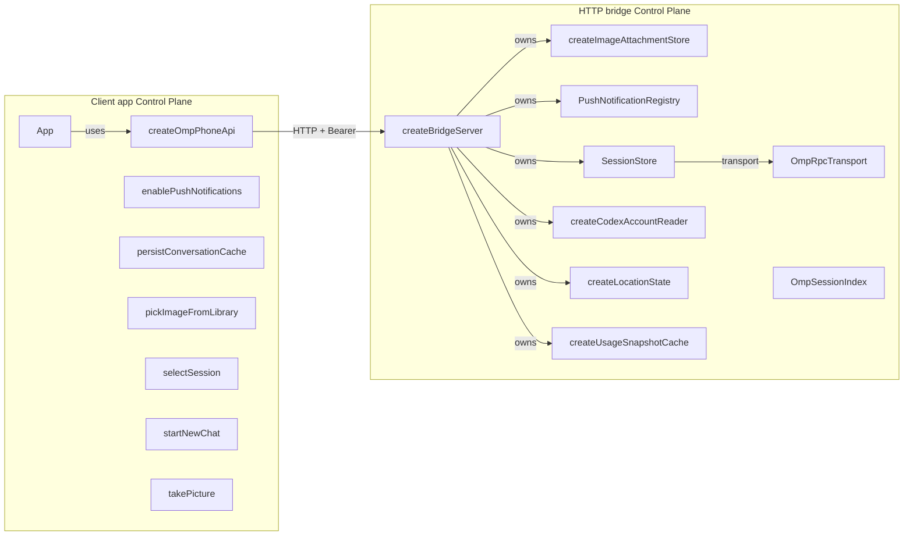
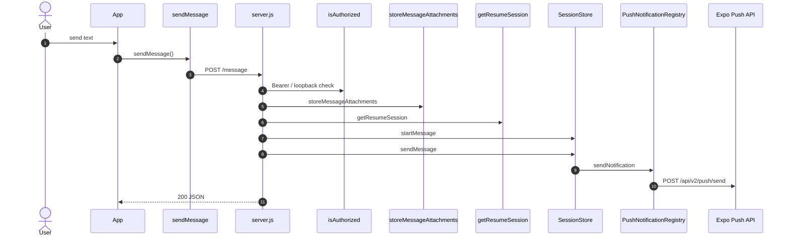

# omp-phone-release — Architecture

Generated by `arch-map` using **deterministic structural AST analysis** (brace-matched JS/TS and Python AST) plus **function → import** bindings and **client data flow**. Same codebase → same document. Zero hallucinations.

| View | Question | Source |
| :--- | :--- | :--- |
| **Level 1 — System context & trust boundary** | Who talks to this system, and what external dependencies lie outside our perimeter? | Entrypoints, URL literals, `spawn`, imported packages |
| **Level 2a — Control plane (wiring)** | How is the application instantiated, configured, and injected? | Factory functions, constructors, and binding graph |
| **Level 2b — Data plane (client data flow)** | How do internal services and storage exchange data at runtime? | Route handlers, variable passing, and client data graph |
| **Level 3 — Request execution flow** | What happens on a critical request end-to-end? | Route handler call-graph walk, parameter contracts, and transforms |

---

## Level 1 — System context & trust boundary

External actors, application workload boundaries, and third-party cloud services. Internal folders such as `test/` and `scripts/` are omitted. Storage services use distinct semantic shapes (`[()]` databases, `[([])]` object stores).

```mermaid
flowchart TB
    subgraph ClientZone["Client Perimeter (Untrusted)"]
        User(["User / Client"])
    end
    subgraph AppBoundary["Workload Boundary (omp-phone-release)"]
        RT_bridge["HTTP bridge\nstart.js, server.js"]
        RT_client["Client app\nindex.js"]
    end
    subgraph CloudPerimeter["External Services & Managed Cloud Perimeter"]
        X_react_native_async_storage_async_storage([("@react-native-async-storage/async-storage")])
        X_Expo_Push_API["Expo Push API"]
        X_codex_process["codex process"]
        X_expo_file_system_legacy["expo-file-system/legacy"]
        X_expo_image_picker["expo-image-picker"]
        X_expo_secure_store["expo-secure-store"]
        X_omp_process["omp process"]
        X_Internet_probe["Internet probe"]
        X_Local_session_files([("Local session files")])
    end
    User -->|touch / type| RT_client
    RT_client -->|HTTP + Bearer| RT_bridge
    RT_bridge -->|import / AsyncStorage| X_react_native_async_storage_async_storage
    RT_bridge -->|HTTPS / https://exp.host/--/api/v2/push/send| X_Expo_Push_API
    RT_bridge -->|spawn / spawn(codex)| X_codex_process
    RT_bridge -->|import / FileSystem| X_expo_file_system_legacy
    RT_bridge -->|import / ImagePicker| X_expo_image_picker
    RT_bridge -->|import / SecureStore| X_expo_secure_store
    RT_bridge -->|spawn / spawn(omp)| X_omp_process
    RT_bridge -->|HTTPS / https://www.gstatic.com/generate_204| X_Internet_probe
    RT_bridge -.->|read/write / bridge/src/omp-usage.js| X_Local_session_files
```

| External system | Kind | Semantic Type | Evidence |
| :--- | :--- | :--- | :--- |
| **@react-native-async-storage/async-storage** | `import` | Object / File Storage | `AsyncStorage` |
| **Expo Push API** | `http` | HTTP / External API | `https://exp.host/--/api/v2/push/send` |
| **codex process** | `process` | Library / SDK | `spawn(codex)` |
| **expo-file-system/legacy** | `import` | Library / SDK | `FileSystem` |
| **expo-image-picker** | `import` | Library / SDK | `ImagePicker` |
| **expo-secure-store** | `import` | Library / SDK | `SecureStore` |
| **omp process** | `process` | Library / SDK | `spawn(omp)` |
| **Internet probe** | `http` | HTTP / External API | `https://www.gstatic.com/generate_204` |
| **Local session files** | `disk` | Library / SDK | `bridge/src/omp-usage.js` |

---

## Level 2a — Control plane (Wiring & Dependency Injection)

Factory functions, constructors, and dependency injection wiring. Shows how service instances and client connections are assembled during startup.



---

## Level 2b — Data plane (Client-to-client data flow)

Runtime data-flow topology. Shows how client components pass intermediate data (arguments, return values) to downstream storage and cloud APIs during request execution. Storage nodes use semantic shapes.

```mermaid
flowchart LR
    subgraph DP_bridge["HTTP bridge Runtime"]
        C_createBridgeServer["createBridgeServer"]
        C_createImageAttachmentStore["createImageAttachmentStore"]
        C_OmpRpcTransport["OmpRpcTransport"]
        C_OmpSessionIndex["OmpSessionIndex"]
        C_PushNotificationRegistry["PushNotificationRegistry"]
        C_SessionStore["SessionStore"]
        C_createCodexAccountReader["createCodexAccountReader"]
        C_createLocationState["createLocationState"]
        C_createUsageSnapshotCache{{"createUsageSnapshotCache"}}
    end
    subgraph DP_client["Client app Runtime"]
        C_createOmpPhoneApi["createOmpPhoneApi"]
        C_App["App"]
        C_enablePushNotifications["enablePushNotifications"]
        C_persistConversationCache{{"persistConversationCache"}}
        C_pickImageFromLibrary["pickImageFromLibrary"]
        C_selectSession["selectSession"]
        C_startNewChat["startNewChat"]
        C_takePicture["takePicture"]
    end
    subgraph DP_Externals["External Persistence & Cloud Services"]
        X_react_native_async_storage_async_storage([("@react-native-async-storage/async-storage")])
        X_Expo_Push_API["Expo Push API"]
        X_codex_process["codex process"]
        X_expo_file_system_legacy["expo-file-system/legacy"]
        X_expo_image_picker["expo-image-picker"]
        X_expo_secure_store["expo-secure-store"]
        X_omp_process["omp process"]
        X_Internet_probe["Internet probe"]
        X_Local_session_files([("Local session files")])
    end
    C_App -->|ImagePicker| X_expo_image_picker
    C_App -->|FileSystem| X_expo_file_system_legacy
    C_App -->|SecureStore| X_expo_secure_store
    C_App -->|AsyncStorage| X_react_native_async_storage_async_storage
    C_persistConversationCache -->|AsyncStorage| X_react_native_async_storage_async_storage
    C_pickImageFromLibrary -->|ImagePicker| X_expo_image_picker
    C_takePicture -->|ImagePicker| X_expo_image_picker
    C_enablePushNotifications -->|AsyncStorage| X_react_native_async_storage_async_storage
    C_selectSession -->|AsyncStorage| X_react_native_async_storage_async_storage
    C_startNewChat -->|AsyncStorage| X_react_native_async_storage_async_storage
    C_PushNotificationRegistry -.->|HTTPS| X_Expo_Push_API
    C_createCodexAccountReader -.->|stdio| X_codex_process
    C_OmpRpcTransport -.->|stdio| X_omp_process
    C_createBridgeServer -.->|HTTPS| X_Internet_probe
    C_createBridgeServer -.->|fs| X_Local_session_files
```

Function → import bindings:

| Component / Function | Import | Binding | File |
| :--- | :--- | :--- | :--- |
| `App` | `@react-native-async-storage/async-storage` | `AsyncStorage` | `client/App.js` |
| `App` | `expo-file-system/legacy` | `FileSystem` | `client/App.js` |
| `App` | `expo-image-picker` | `ImagePicker` | `client/App.js` |
| `App` | `expo-secure-store` | `SecureStore` | `client/App.js` |
| `enablePushNotifications` | `@react-native-async-storage/async-storage` | `AsyncStorage` | `client/App.js` |
| `persistConversationCache` | `@react-native-async-storage/async-storage` | `AsyncStorage` | `client/App.js` |
| `pickImageFromLibrary` | `expo-image-picker` | `ImagePicker` | `client/App.js` |
| `selectSession` | `@react-native-async-storage/async-storage` | `AsyncStorage` | `client/App.js` |
| `startNewChat` | `@react-native-async-storage/async-storage` | `AsyncStorage` | `client/App.js` |
| `takePicture` | `expo-image-picker` | `ImagePicker` | `client/App.js` |

---

## Level 3 — Request execution flow

Traced **`POST /message`** from `bridge/src/server.js` (client method `sendMessage` in `client/src/api.js`). Handler call-graph walk with parameter bindings.

Request body fields read in handler: `attachments`, `sessionId`, `async`, `text`.

Branch: `body.async` chooses `startMessage` (non-blocking) vs `sendMessage` (await completion).



### Transform table

| Step | From → To | Action | Where |
| :--- | :--- | :--- | :--- |
| 1 | App → API | `sendMessage` sends `POST /message` (`attachments, sessionId, async, text`) | `client/src/api.js` |
| 2 | `User` → `HTTP` | `POST /message` | `bridge/src/server.js` |
| 3 | `HTTP` → `isAuthorized` | `Bearer / loopback check` | `bridge/src/server.js` |
| 4 | `HTTP` → `storeMessageAttachments` | `storeMessageAttachments` | `bridge/src/server.js` |
| 5 | `HTTP` → `getResumeSession` | `getResumeSession` | `bridge/src/server.js` |
| 6 | `HTTP` → `SessionStore` | `startMessage` | `bridge/src/session-store.js` |
| 7 | `HTTP` → `SessionStore` | `sendMessage` | `bridge/src/session-store.js` |
| 8 | `SessionStore` → `PushNotificationRegistry` | `sendNotification` | `bridge/src/push-notifications.js` |
| 9 | `PushNotificationRegistry` → `Expo Push API` | `POST /api/v2/push/send` | `bridge/src/push-notifications.js` |

---

## Routes

| Method | Path | Defined in |
| :--- | :--- | :--- |
| `GET` | `/ping` | `bridge/src/server.js` |
| `GET` | `/health` | `bridge/src/server.js` |
| `GET` | `/markdown-document` | `bridge/src/server.js` |
| `GET` | `/location` | `bridge/src/server.js` |
| `POST` | `/location` | `bridge/src/server.js` |
| `POST` | `/message` | `bridge/src/server.js` |
| `GET` | `/sessions` | `bridge/src/server.js` |
| `GET` | `/notifications/devices` | `bridge/src/server.js` |
| `POST` | `/notifications/devices` | `bridge/src/server.js` |
| `POST` | `/notifications/visibility` | `bridge/src/server.js` |
| `POST` | `/notifications/send` | `bridge/src/server.js` |
| `GET` | `/usage` | `bridge/src/server.js` |
| `GET` | `/sessions/:param/messages` | `bridge/src/server.js` |
| `POST` | `/sessions/:param/interrupt` | `bridge/src/server.js` |
| `GET` | `/attachments/images/:param` | `bridge/src/server.js` |

---

## Environment & lift-and-shift matrix

Inventory of environment variables required to run or migrate this codebase.

| Environment variable | Consumed in | Declared in | Type |
| :--- | :--- | :--- | :--- |
| `EXPO_ACCESS_TOKEN` | `push-notifications.js` | *Runtime only* | Secret / Token |
| `NODE_TEST_CONTEXT` | `logger.js` | *Runtime only* | Config Setting |
| `OMP_COMMAND` | *Declared only* | `.env.example` | Config Setting |
| `OMP_PHONE_ALLOW_LOOPBACK_NO_TOKEN` | `server.js` | *Runtime only* | Secret / Token |
| `OMP_PHONE_BRIDGE_LABEL` | `local-release.js` | *Runtime only* | Config Setting |
| `OMP_PHONE_BRIDGE_PLIST` | `local-release.js` | *Runtime only* | Config Setting |
| `OMP_PHONE_BRIDGE_URL` | `local-release.js` | *Runtime only* | Endpoint / Connection |
| `OMP_PHONE_CONNECTIVITY_TIMEOUT_MS` | `server.js` | *Runtime only* | Config Setting |
| `OMP_PHONE_CONNECTIVITY_URL` | `server.js` | *Runtime only* | Endpoint / Connection |
| `OMP_PHONE_DISABLE_SESSION_INDEX` | `server.js` | *Runtime only* | Feature Flag / Mode |
| `OMP_PHONE_HOST` | *Declared only* | `.env.example` | Endpoint / Connection |
| `OMP_PHONE_LOG_LEVEL` | `logger.js` | *Runtime only* | Config Setting |
| `OMP_PHONE_MARKDOWN_ROOTS` | `server.js` | *Runtime only* | Path / Directory |
| `OMP_PHONE_METRO_LABEL` | `local-release.js` | *Runtime only* | Config Setting |
| `OMP_PHONE_METRO_PLIST` | `local-release.js` | *Runtime only* | Config Setting |
| `OMP_PHONE_METRO_URL` | `local-release.js` | *Runtime only* | Endpoint / Connection |
| `OMP_PHONE_PORT` | *Declared only* | `.env.example` | Endpoint / Connection |
| `OMP_PHONE_RELEASE_COMMIT` | `server.js` | *Runtime only* | Config Setting |
| `OMP_PHONE_RELEASE_ROOT` | `server.js`, `local-release.js` | *Runtime only* | Path / Directory |
| `OMP_PHONE_RELEASE_STATE_DIR` | `local-release.js` | *Runtime only* | Path / Directory |
| `OMP_PHONE_TOKEN` | `server.js` | `.env.example` | Secret / Token |
| `OMP_PHONE_TRANSPORT` | `server.js` | `.env.example` | Endpoint / Connection |
| `PI_CODING_AGENT_DIR` | `omp-session-index.js` | *Runtime only* | Path / Directory |
