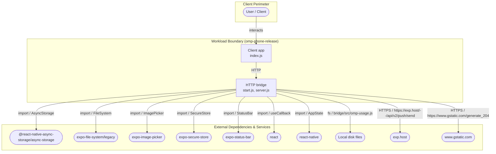
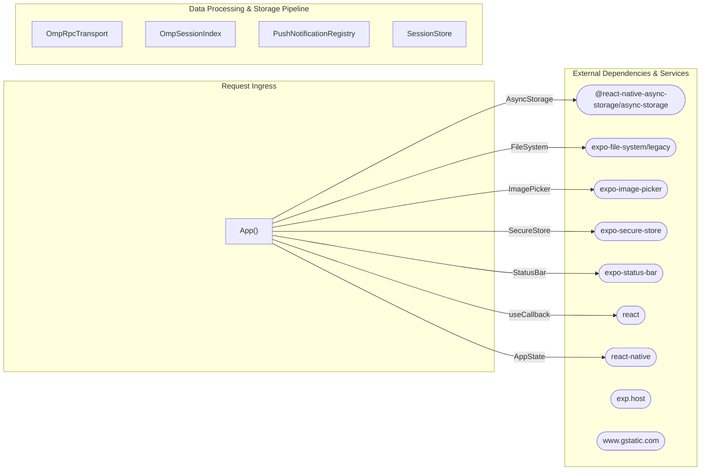
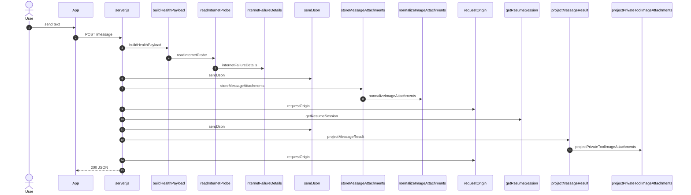

```mermaid
flowchart TB
    subgraph CP_bridge["HTTP bridge Control Plane"]
        C_OmpRpcTransport["OmpRpcTransport()"]
        C_OmpSessionIndex["OmpSessionIndex()"]
        C_PushNotificationRegistry["PushNotificationRegistry()"]
        C_SessionStore["SessionStore()"]
        C_createBridgeServer["createBridgeServer()"]
        C_checkInternetConnectivity["checkInternetConnectivity()"]
        C_defaultSessionIndex["defaultSessionIndex()"]
        C_defaultTransportFactory["defaultTransportFactory()"]
        C_start["start()"]
    end
    subgraph CP_client["Client app Control Plane"]
        C_App["App()"]
        C_enablePushNotifications["enablePushNotifications()"]
        C_persistConversationCache["persistConversationCache()"]
        C_pickImageFromLibrary["pickImageFromLibrary()"]
        C_selectSession["selectSession()"]
        C_send["send()"]
        C_startNewChat["startNewChat()"]
        C_syncActiveSession["syncActiveSession()"]
        C_takePicture["takePicture()"]
        C_createOmpPhoneApi["createOmpPhoneApi()"]
        C_request["request()"]
    end
    C_createBridgeServer -->|owns| C_SessionStore
    C_createBridgeServer -->|owns| C_PushNotificationRegistry
    C_defaultSessionIndex -->|owns| C_OmpSessionIndex
    C_defaultTransportFactory -->|owns| C_OmpRpcTransport
    C_App -->|uses| C_createOmpPhoneApi
    C_createOmpPhoneApi -->|HTTP| C_createBridgeServer
    click C_OmpRpcTransport href "../../../../services/omp-phone-release/bridge/src/omp-rpc-transport.js#L15" "Jump to OmpRpcTransport in bridge/src/omp-rpc-transport.js"
    click C_OmpSessionIndex href "../../../../services/omp-phone-release/bridge/src/omp-session-index.js#L16" "Jump to OmpSessionIndex in bridge/src/omp-session-index.js"
    click C_PushNotificationRegistry href "../../../../services/omp-phone-release/bridge/src/push-notifications.js#L21" "Jump to PushNotificationRegistry in bridge/src/push-notifications.js"
    click C_SessionStore href "../../../../services/omp-phone-release/bridge/src/session-store.js#L15" "Jump to SessionStore in bridge/src/session-store.js"
    click C_createBridgeServer href "../../../../services/omp-phone-release/bridge/src/server.js#L37" "Jump to createBridgeServer in bridge/src/server.js"
    click C_checkInternetConnectivity href "../../../../services/omp-phone-release/bridge/src/server.js#L589" "Jump to checkInternetConnectivity in bridge/src/server.js"
    click C_defaultSessionIndex href "../../../../services/omp-phone-release/bridge/src/server.js#L450" "Jump to defaultSessionIndex in bridge/src/server.js"
    click C_defaultTransportFactory href "../../../../services/omp-phone-release/bridge/src/server.js#L437" "Jump to defaultTransportFactory in bridge/src/server.js"
    click C_start href "../../../../services/omp-phone-release/bridge/src/usage-snapshot.js#L49" "Jump to start in bridge/src/usage-snapshot.js"
    click C_App href "../../../../services/omp-phone-release/client/App.js#L139" "Jump to App in client/App.js"
    click C_enablePushNotifications href "../../../../services/omp-phone-release/client/App.js#L935" "Jump to enablePushNotifications in client/App.js"
    click C_persistConversationCache href "../../../../services/omp-phone-release/client/App.js#L574" "Jump to persistConversationCache in client/App.js"
    click C_pickImageFromLibrary href "../../../../services/omp-phone-release/client/App.js#L893" "Jump to pickImageFromLibrary in client/App.js"
    click C_selectSession href "../../../../services/omp-phone-release/client/App.js#L1042" "Jump to selectSession in client/App.js"
    click C_send href "../../../../services/omp-phone-release/client/App.js#L963" "Jump to send in client/App.js"
    click C_startNewChat href "../../../../services/omp-phone-release/client/App.js#L1081" "Jump to startNewChat in client/App.js"
    click C_syncActiveSession href "../../../../services/omp-phone-release/client/App.js#L464" "Jump to syncActiveSession in client/App.js"
    click C_takePicture href "../../../../services/omp-phone-release/client/App.js#L897" "Jump to takePicture in client/App.js"
    click C_createOmpPhoneApi href "../../../../services/omp-phone-release/client/src/api.js#L35" "Jump to createOmpPhoneApi in client/src/api.js"
    click C_request href "../../../../services/omp-phone-release/client/src/api.js#L40" "Jump to request in client/src/api.js"
```

# omp-phone-release — Architecture

Generated by `arch-map` using **deterministic structural AST analysis** (brace-matched JS/TS and Python AST) plus **function → import** bindings and **client data flow**. Same codebase -> same document. Zero hallucinations.

| View | Question | Source |
| :--- | :--- | :--- |
| **Level 1 — System context & external dependencies** | Who talks to this system, and what external packages/APIs are called? | Entrypoints, URL literals, `spawn`, imported packages |
| **Level 2a — Control plane (wiring)** | How is the application instantiated, configured, and injected? | Factory functions, constructors, and binding graph |
| **Level 2b — Data plane (client data flow)** | How do internal services and storage exchange data at runtime? | Route handlers, variable passing, and client data graph |
| **Level 3 — Request execution flow** | What happens on a critical request end-to-end? | Route handler call-graph walk, parameter contracts, and transforms |

---

## Level 1 — System context & external dependencies

Internal workload boundary versus external libraries, SDKs, and services. Internal folders such as `test/` and `scripts/` are omitted.

| External system | Kind | Evidence |
| :--- | :--- | :--- |
| **@react-native-async-storage/async-storage** | `import` | `AsyncStorage` |
| **expo-file-system/legacy** | `import` | `FileSystem` |
| **expo-image-picker** | `import` | `ImagePicker` |
| **expo-secure-store** | `import` | `SecureStore` |
| **expo-status-bar** | `import` | `StatusBar` |
| **react** | `import` | `useCallback` |
| **react-native** | `import` | `AppState` |
| **Local disk files** | `disk` | `bridge/src/omp-usage.js` |
| **exp.host** | `http` | `https://exp.host/--/api/v2/push/send` |
| **www.gstatic.com** | `http` | `https://www.gstatic.com/generate_204` |

---

## Level 2a — Control plane (Wiring & Dependency Injection)

Factory functions, constructors, and dependency injection wiring. Shows how service instances and client connections are assembled during startup.

---

## Level 2b — Data plane (Client-to-client data flow)

Runtime data-flow topology. Shows how client components pass intermediate data (arguments, return values) to downstream storage and cloud APIs during request execution.

Function → import bindings:

| Component / Function | Import | Binding | File |
| :--- | :--- | :--- | :--- |
| `App` | `@react-native-async-storage/async-storage` | `AsyncStorage` | `client/App.js` |
| `App` | `expo-file-system/legacy` | `FileSystem` | `client/App.js` |
| `App` | `expo-image-picker` | `ImagePicker` | `client/App.js` |
| `App` | `expo-secure-store` | `SecureStore` | `client/App.js` |
| `App` | `expo-status-bar` | `StatusBar` | `client/App.js` |
| `App` | `react` | `useCallback` | `client/App.js` |
| `App` | `react-native` | `AppState` | `client/App.js` |
| `enablePushNotifications` | `@react-native-async-storage/async-storage` | `AsyncStorage` | `client/App.js` |
| `persistConversationCache` | `@react-native-async-storage/async-storage` | `AsyncStorage` | `client/App.js` |
| `pickImageFromLibrary` | `expo-image-picker` | `ImagePicker` | `client/App.js` |
| `selectSession` | `@react-native-async-storage/async-storage` | `AsyncStorage` | `client/App.js` |
| `send` | `react-native` | `Image` | `client/App.js` |
| `startNewChat` | `@react-native-async-storage/async-storage` | `AsyncStorage` | `client/App.js` |
| `startNewChat` | `react-native` | `Keyboard` | `client/App.js` |
| `syncActiveSession` | `react-native` | `AppState` | `client/App.js` |
| `takePicture` | `expo-image-picker` | `ImagePicker` | `client/App.js` |

---

## Level 3 — Request execution flow

Traced **`POST /message`** from `bridge/src/server.js`. Handler call-graph walk with parameter bindings.

Request body fields read in handler: `attachments`, `sessionId`, `async`, `text`.

Branch: `body.async` chooses `startMessage` (non-blocking) vs `sendMessage` (await completion).

### Transform table

| Step | From → To | Action | Where |
| :--- | :--- | :--- | :--- |
| 1 | `User` → `HTTP` | `POST /message` | `bridge/src/server.js` |
| 2 | `HTTP` → `buildHealthPayload` | `buildHealthPayload` | `bridge/src/server.js` |
| 3 | `buildHealthPayload` → `readInternetProbe` | `readInternetProbe` | `bridge/src/server.js` |
| 4 | `readInternetProbe` → `internetFailureDetails` | `internetFailureDetails` | `bridge/src/server.js` |
| 5 | `HTTP` → `sendJson` | `sendJson` | `bridge/src/server.js` |
| 6 | `HTTP` → `storeMessageAttachments` | `storeMessageAttachments` | `bridge/src/server.js` |
| 7 | `storeMessageAttachments` → `normalizeImageAttachments` | `normalizeImageAttachments` | `bridge/src/image-attachments.js` |
| 8 | `HTTP` → `requestOrigin` | `requestOrigin` | `bridge/src/server.js` |
| 9 | `HTTP` → `getResumeSession` | `getResumeSession` | `bridge/src/server.js` |
| 10 | `HTTP` → `sendJson` | `sendJson` | `bridge/src/server.js` |
| 11 | `HTTP` → `projectMessageResult` | `projectMessageResult` | `bridge/src/server.js` |
| 12 | `projectMessageResult` → `projectPrivateToolImageAttachments` | `projectPrivateToolImageAttachments` | `bridge/src/server.js` |
| 13 | `HTTP` → `requestOrigin` | `requestOrigin` | `bridge/src/server.js` |

---

## Routes

| Method | Path | Defined in |
| :--- | :--- | :--- |
| `GET` | `/ping` | `bridge/src/server.js` |
| `GET` | `/health` | `bridge/src/server.js` |
| `GET` | `/markdown-document` | `bridge/src/server.js` |
| `GET` | `/location` | `bridge/src/server.js` |
| `POST` | `/location` | `bridge/src/server.js` |
| `POST` | `/message` | `bridge/src/server.js` |
| `GET` | `/sessions` | `bridge/src/server.js` |
| `GET` | `/notifications/devices` | `bridge/src/server.js` |
| `POST` | `/notifications/devices` | `bridge/src/server.js` |
| `POST` | `/notifications/visibility` | `bridge/src/server.js` |
| `POST` | `/notifications/send` | `bridge/src/server.js` |
| `GET` | `/usage` | `bridge/src/server.js` |

---

## Environment & lift-and-shift matrix

Inventory of environment variables required to run or migrate this codebase.

| Environment variable | Consumed in | Declared in |
| :--- | :--- | :--- |
| `EXPO_ACCESS_TOKEN` | `push-notifications.js` | *Runtime only* |
| `NODE_TEST_CONTEXT` | `logger.js` | *Runtime only* |
| `OMP_COMMAND` | *Declared only* | `.env.example` |
| `OMP_PHONE_ALLOW_LOOPBACK_NO_TOKEN` | `server.js` | *Runtime only* |
| `OMP_PHONE_BRIDGE_LABEL` | `local-release.js` | *Runtime only* |
| `OMP_PHONE_BRIDGE_PLIST` | `local-release.js` | *Runtime only* |
| `OMP_PHONE_BRIDGE_URL` | `local-release.js` | *Runtime only* |
| `OMP_PHONE_CONNECTIVITY_TIMEOUT_MS` | `server.js` | *Runtime only* |
| `OMP_PHONE_CONNECTIVITY_URL` | `server.js` | *Runtime only* |
| `OMP_PHONE_DISABLE_SESSION_INDEX` | `server.js` | *Runtime only* |
| `OMP_PHONE_HOST` | *Declared only* | `.env.example` |
| `OMP_PHONE_LOG_LEVEL` | `logger.js` | *Runtime only* |
| `OMP_PHONE_MARKDOWN_ROOTS` | `server.js` | *Runtime only* |
| `OMP_PHONE_METRO_LABEL` | `local-release.js` | *Runtime only* |
| `OMP_PHONE_METRO_PLIST` | `local-release.js` | *Runtime only* |
| `OMP_PHONE_METRO_URL` | `local-release.js` | *Runtime only* |
| `OMP_PHONE_PORT` | *Declared only* | `.env.example` |
| `OMP_PHONE_RELEASE_COMMIT` | `server.js` | *Runtime only* |
| `OMP_PHONE_RELEASE_ROOT` | `server.js`, `local-release.js` | *Runtime only* |
| `OMP_PHONE_RELEASE_STATE_DIR` | `local-release.js` | *Runtime only* |
| `OMP_PHONE_TOKEN` | `server.js` | `.env.example` |
| `OMP_PHONE_TRANSPORT` | `server.js` | `.env.example` |
| `PI_CODING_AGENT_DIR` | `omp-session-index.js` | *Runtime only* |
