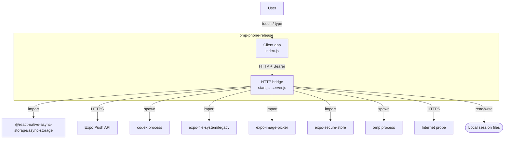
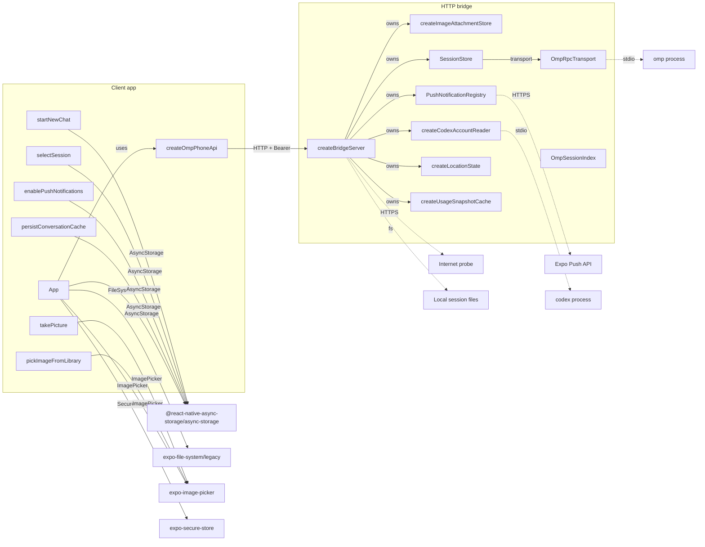
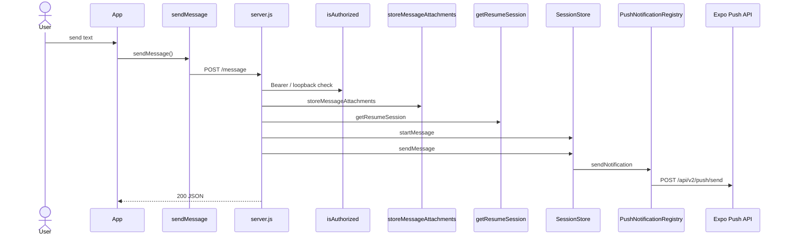

# omp-phone-release — Architecture

Generated by `arch-map` using **deterministic structural JS/TS analysis** and **Python AST** (functions, classes, imports, routes, and call resolution) plus **function → import** edges (the import name as written in source, not a renamed cloud product). No language server is used in this pass. Same tree → same document.

| View | Question | Source |
| :--- | :--- | :--- |
| **Level 1 — System context** | Who talks to this system, and what is outside it? | Entrypoints, URL literals, `spawn`, imported packages |
| **Level 2 — Service topology** | Which functions use which imports? | Function body mentions of imported names |
| **Level 3 — Data flow** | What happens on one request? | Handler call graph, then each function's imports |

---

## Level 1 — System context

People and external systems around this repository. Internal folders such as `test/` and `scripts/` are omitted. External nodes are import names (`azure.cosmos`, `azure.ai.projects`, `gremlin_python...`) plus spawn/URL I/O. No product-name translation.

| External system | Kind | Evidence |
| :--- | :--- | :--- |
| **@react-native-async-storage/async-storage** | `import` | `AsyncStorage` |
| **Expo Push API** | `http` | `https://exp.host/--/api/v2/push/send` |
| **codex process** | `process` | `spawn(codex)` |
| **expo-file-system/legacy** | `import` | `FileSystem` |
| **expo-image-picker** | `import` | `ImagePicker` |
| **expo-secure-store** | `import` | `SecureStore` |
| **omp process** | `process` | `spawn(omp)` |
| **Internet probe** | `http` | `https://www.gstatic.com/generate_204` |
| **Local session files** | `disk` | `bridge/src/omp-usage.js` |

---

## Level 2 — Service topology

Deployable / process pieces and the components they compose. UI widgets and test doubles are omitted. Each function points at the import names it mentions. `gremlin` stays `gremlin`.

Function → import (the graph above is this table):

| Function | Import | Binding | File |
| :--- | :--- | :--- | :--- |
| `App` | `@react-native-async-storage/async-storage` | `AsyncStorage` | `client/App.js` |
| `App` | `expo-file-system/legacy` | `FileSystem` | `client/App.js` |
| `App` | `expo-image-picker` | `ImagePicker` | `client/App.js` |
| `App` | `expo-secure-store` | `SecureStore` | `client/App.js` |
| `enablePushNotifications` | `@react-native-async-storage/async-storage` | `AsyncStorage` | `client/App.js` |
| `persistConversationCache` | `@react-native-async-storage/async-storage` | `AsyncStorage` | `client/App.js` |
| `pickImageFromLibrary` | `expo-image-picker` | `ImagePicker` | `client/App.js` |
| `selectSession` | `@react-native-async-storage/async-storage` | `AsyncStorage` | `client/App.js` |
| `startNewChat` | `@react-native-async-storage/async-storage` | `AsyncStorage` | `client/App.js` |
| `takePicture` | `expo-image-picker` | `ImagePicker` | `client/App.js` |

See **Routes** below for the full endpoint list.

---

## Level 3 — Request data flow

Traced **`POST /message`** from `bridge/src/server.js` (client method `sendMessage` in `client/src/api.js`). Handler call-graph walk (no language server).

Request body fields read in the handler: `attachments`, `sessionId`, `async`, `text`.

Branch: `body.async` chooses `startMessage` (non-blocking) vs `sendMessage` (await completion).

### Transform table

| Step | From → to | Action | Where |
| :--- | :--- | :--- | :--- |
| 1 | App → API | `sendMessage` sends `POST /message` (`attachments, sessionId, async, text`) | `client/src/api.js` |
| 2 | `User` → `HTTP` | `POST /message` | `bridge/src/server.js` |
| 3 | `HTTP` → `isAuthorized` | `Bearer / loopback check` | `bridge/src/server.js` |
| 4 | `HTTP` → `storeMessageAttachments` | `storeMessageAttachments` | `bridge/src/server.js` |
| 5 | `HTTP` → `getResumeSession` | `getResumeSession` | `bridge/src/server.js` |
| 6 | `HTTP` → `SessionStore` | `startMessage` | `bridge/src/session-store.js` |
| 7 | `HTTP` → `SessionStore` | `sendMessage` | `bridge/src/session-store.js` |
| 8 | `SessionStore` → `PushNotificationRegistry` | `sendNotification` | `bridge/src/push-notifications.js` |
| 9 | `PushNotificationRegistry` → `Expo Push API` | `POST /api/v2/push/send` | `bridge/src/push-notifications.js` |

---

## Routes

| Method | Path | Defined in |
| :--- | :--- | :--- |
| `GET` | `/ping` | `bridge/src/server.js` |
| `GET` | `/health` | `bridge/src/server.js` |
| `GET` | `/markdown-document` | `bridge/src/server.js` |
| `GET` | `/location` | `bridge/src/server.js` |
| `POST` | `/location` | `bridge/src/server.js` |
| `POST` | `/message` | `bridge/src/server.js` |
| `GET` | `/sessions` | `bridge/src/server.js` |
| `GET` | `/notifications/devices` | `bridge/src/server.js` |
| `POST` | `/notifications/devices` | `bridge/src/server.js` |
| `POST` | `/notifications/visibility` | `bridge/src/server.js` |
| `POST` | `/notifications/send` | `bridge/src/server.js` |
| `GET` | `/usage` | `bridge/src/server.js` |
| `GET` | `/sessions/:param/messages` | `bridge/src/server.js` |
| `POST` | `/sessions/:param/interrupt` | `bridge/src/server.js` |
| `GET` | `/attachments/images/:param` | `bridge/src/server.js` |

---

## Environment & lift-and-shift matrix

Inventory of environment variables required to run or migrate this codebase.

| Environment variable | Consumed in | Declared in | Type |
| :--- | :--- | :--- | :--- |
| `EXPO_ACCESS_TOKEN` | `push-notifications.js` | *Runtime only* | Secret / Token |
| `NODE_TEST_CONTEXT` | `logger.js` | *Runtime only* | Config Setting |
| `OMP_COMMAND` | *Declared only* | `.env.example` | Config Setting |
| `OMP_PHONE_ALLOW_LOOPBACK_NO_TOKEN` | `server.js` | *Runtime only* | Secret / Token |
| `OMP_PHONE_BRIDGE_LABEL` | `local-release.js` | *Runtime only* | Config Setting |
| `OMP_PHONE_BRIDGE_PLIST` | `local-release.js` | *Runtime only* | Config Setting |
| `OMP_PHONE_BRIDGE_URL` | `local-release.js` | *Runtime only* | Endpoint / Connection |
| `OMP_PHONE_CONNECTIVITY_TIMEOUT_MS` | `server.js` | *Runtime only* | Config Setting |
| `OMP_PHONE_CONNECTIVITY_URL` | `server.js` | *Runtime only* | Endpoint / Connection |
| `OMP_PHONE_DISABLE_SESSION_INDEX` | `server.js` | *Runtime only* | Feature Flag / Mode |
| `OMP_PHONE_HOST` | *Declared only* | `.env.example` | Endpoint / Connection |
| `OMP_PHONE_LOG_LEVEL` | `logger.js` | *Runtime only* | Config Setting |
| `OMP_PHONE_MARKDOWN_ROOTS` | `server.js` | *Runtime only* | Path / Directory |
| `OMP_PHONE_METRO_LABEL` | `local-release.js` | *Runtime only* | Config Setting |
| `OMP_PHONE_METRO_PLIST` | `local-release.js` | *Runtime only* | Config Setting |
| `OMP_PHONE_METRO_URL` | `local-release.js` | *Runtime only* | Endpoint / Connection |
| `OMP_PHONE_PORT` | *Declared only* | `.env.example` | Endpoint / Connection |
| `OMP_PHONE_RELEASE_COMMIT` | `server.js` | *Runtime only* | Config Setting |
| `OMP_PHONE_RELEASE_ROOT` | `server.js`, `local-release.js` | *Runtime only* | Path / Directory |
| `OMP_PHONE_RELEASE_STATE_DIR` | `local-release.js` | *Runtime only* | Path / Directory |
| `OMP_PHONE_TOKEN` | `server.js` | `.env.example` | Secret / Token |
| `OMP_PHONE_TRANSPORT` | `server.js` | `.env.example` | Endpoint / Connection |
| `PI_CODING_AGENT_DIR` | `omp-session-index.js` | *Runtime only* | Path / Directory |
